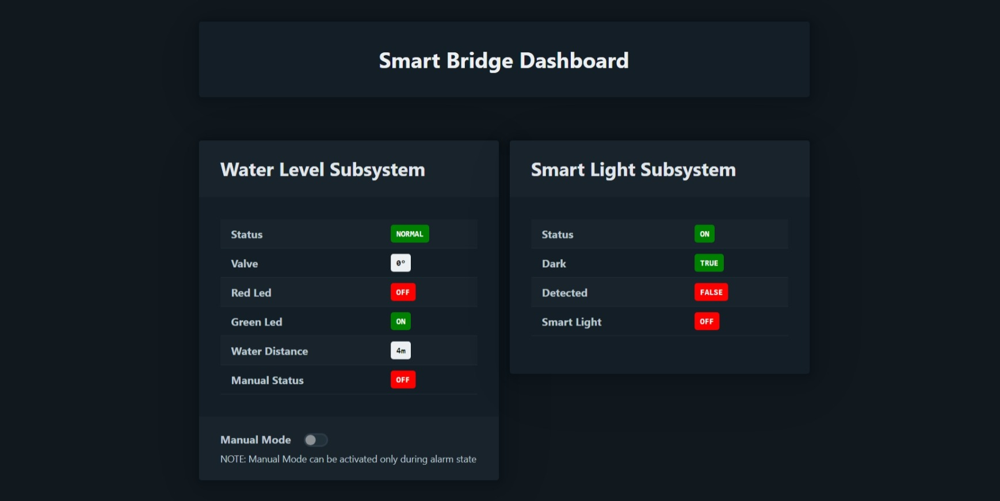

# Smart Bridge Dashboard
In the project directory, you can run:
- `npm run start:ditto` to run the app in [Eclipse Ditto](https://eclipse.dev/ditto/index.html) environment 
- `npm run start:wldt` to run the app in [White Label Digital Twin](https://github.com/wldt) environment 
Depending on the selected environment, the application will use the API of the corresponding framework.
Open [http://localhost:3000](http://localhost:3000) to view it in your browser.

**Note**: If you are using Eclipse Ditto API as the data source for the Smart Bridge, credentials will be required for access; in this case, we use the default ones: username 'ditto' and password 'ditto'.

